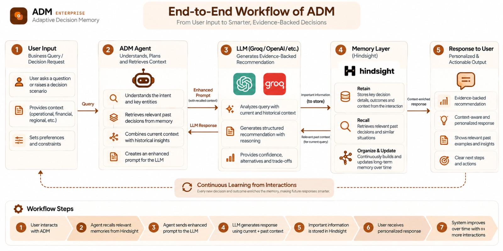

# ADM — Adaptive Decision Memory

> An AI decision-support system that remembers past vendor decisions, outcomes, and lessons to support better future decisions.

## Overview

ADM (Adaptive Decision Memory) helps project and operations teams make vendor-selection decisions using organizational experience stored as persistent memory.

Instead of treating every vendor decision as a new problem, ADM records:

- The decision and its context
- Requirements and evaluation factors
- Reasoning behind the decision
- Expected outcome
- Actual outcome
- What went well and what went wrong
- Lessons that should be remembered

When a similar decision happens later, ADM retrieves relevant historical experience from Hindsight and uses an LLM to turn that experience into decision-support context.

The human decision-maker always remains responsible for the final decision.

---

## The Problem

Organizations repeatedly make similar vendor decisions, but the reasoning and lessons from previous decisions are often lost in documents, conversations, or individual memory.

For example:

A team selects Vendor A because it offers the lowest cost and promises delivery within 7 days.

The project later discovers that Vendor A takes 14 days to deliver and has quality problems.

Without persistent organizational memory, the next project may make the same mistake.

ADM closes that loop.

---

## How ADM Works

ADM follows a continuous decision-memory lifecycle:

```text
Decision
   ↓
Reasoning
   ↓
Evidence
   ↓
Expected Outcome
   ↓
Actual Outcome
   ↓
Lesson
   ↓
Hindsight Memory
   ↓
Future Decision

# ADM_Workflow


